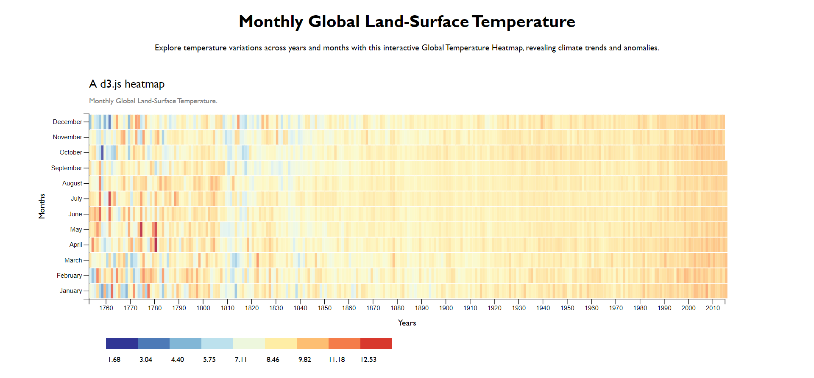

# Global Temperature Heatmap

This project displays a heatmap of global temperature variances over the years. It uses D3.js to create an interactive visualization that allows users to explore temperature changes month by month.

## Features

- **Interactive Heatmap**: Hover over each cell to view details about the temperature variance for a specific month and year.
- **Color Legend**: Below the heatmap, you'll find a color legend that maps temperature values to colors, making it easy to interpret the data.
- **Informative Tooltip**: A tooltip appears when you hover over a cell, providing additional information about the selected data point, including the year, month, temperature variance, and base temperature.

## How to Use

View the Heatmap: Open the project in a web browser. The heatmap will be displayed on the webpage, showing temperature variances across different months and years.

Interact with Data: Hover over a cell to see detailed information about the temperature variance for a specific month and year.

Color Legend: Below the heatmap, you'll find a legend that associates colors with temperature values. This helps you understand the temperature range represented by the colors in the heatmap.

## Data Source

The project uses data from the freeCodeCamp Global Temperature dataset.

## Technologies Used

**D3.js**: A JavaScript library for creating data visualizations in the browser.

## Project Structure

- **index.html**: The HTML file containing the structure of the webpage.
- **style.css**: The CSS file for styling the heatmap and legend.
- **main.js**: The JavaScript file that uses D3.js to load and visualize the data.

## Credits

This project was created as part of a data visualization exercise and is based on the freeCodeCamp Data Visualization curriculum.

## License

This project is open-source and available under the MIT License.
